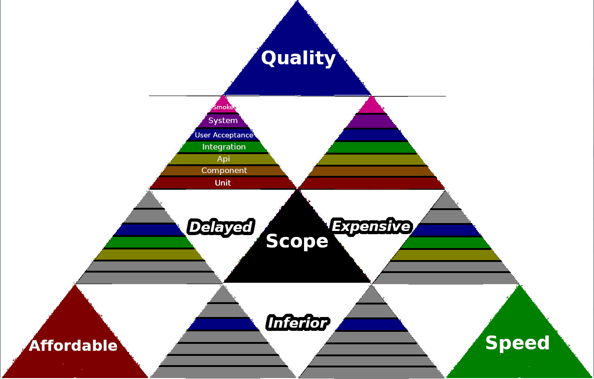

= Client-Server Test Pyramid

Much software testing terminology is incoherent. The phrase "Integration Testing" may have as many definitions as there are companies that perform it. Some take it farther and start making up terms to describe the same thing just for good measure.

These can still be useful, distinctive words, but it's more likely you'll get consensus when talking about the _types of defects_ testing can prevent.

Regardless of all the different models out there, there is an industry consensus that you need to test software in layers because certain problems can only be detected in specific contexts.

While there is yet another test pyramid included in this document surrounded by heavily abused terminology, the main point here are the kinds of problems that require different types of tests:

[cols=2*]
|===
| *Problem*
| *Reasonabl testing term*

| Was our recent deploy successful? Is the application working for users right now?
| Smoke

| Physically, are there enough resources to handle the workload?
| System

| Does the application allow our users to do what they need to do? Are they able to figure out how to use the application?
| User Acceptance

| Logically, do the client and server interact appropriately in some environment?
| Integration (Client + Server)

| Does the client work well on it's own if it gets expected input?
| API (Client side)

| Does the server successfully translate a request from a client into the appropriate action?
| API (Server side)

| Does the class or method work when used by another class or method?
| Component

| Does the class or method work when everything else around it works?
| Unit

|
|

| Does my code work by itself?
| Hermetic

|Does my code work with your code?
| Non-Hermetic
|===

== Pyramid Scheme

In addition to the idea that we need multiple types of testing, there is a consensus on the overall quantity we should have of each type.

The basic idea is that the more sensitive a test is to the environment, the broader in scope they are and more expensive to write, the fewer of them should be written. This actually turns out to be quite practical for another reason: the higher in the pyramid the tests are, the broader their coverage; therefore there is no _need_ for as many.

== Organizational Strategy

Often Product Managers will use the "Iron Triangle" to illustrate trade offs that need to be made in developing software. Software can be any one of these:

[cols=2*]
|===
| *Pro*
| *Con*

| Cheap & Quick
| Low Quality

| Cheap & Good
| Low Priority

| Fast & Good
| Expensive

|===

The Test Strategy more or less follows the overall organization strategy in this manner. In practice, *if there are very few test resources then the middle part of the pyramid is where to focus*. This is because a very small number of integration tests can provide the most coverage without the additional hardware costs needed for system testing. 

Development might favor API tests instead of unit tests because unit tests are tightly coupled to the API and will break quickly while features are volatile and in development. If time and budget for this is a concern then API tests make more sense because they provide broader coverage and are less likely to break with code changes.

If quality _is_ a priority than the full test pyramid is worth aspiring to. This will include testing in every tier of the program, with the majority being unit tests.

Note the further away from *Quality* you move, the fewer tiers of the test pyramid
can be included in the overall strategy due to budget and time constraints.

== Hermetic vs. Non-Hermetic tests

The tests in the top half of the pyramid can detect environment issues. This is great because even if the code works logically in isolation it can fail as soon as it connects to foreign APIs or execute in unfamiliar territory. In the Client-Server Test Pyramid, this starts with Integration tests which check to see if the application logically works. 

There are then User Acceptance tests that make sure the business requirements are implemented properly from the end users perspective. 

The System tests determine that there is adequate throughput, CPUs, networking and physical infrastructure. 

Finally, there are smoke tests to make sure the application works properly after it is deployed.

However, all of these tests have some major drawbacks. They are:

* Slow to execute
* Expensive to write (especially system tests, which may require a duplicate environment)
* Vague when they fail
* Have low traceability
* Prone to environment issues which cause noise in the results

For this reason it is advisable to _also_ have hermetic tests. These are useful for all the reasons non-hermetic tests aren't. Because hermetic tests execute quickly they are suitable to run frequently, both during development and before committing code. They are much smaller in scope, so tend to be quick to write. The failures are much more specific and easy to trace. Most importantly, they are immune from environment issues. This means when they fail, development can have a reasonably high level of confidence it is because _their own_ code has broken, not someone else's.

Tests on the API layer and below can be (and typically should be) hermetic. Integration tests and above by definition are non hermetic.
