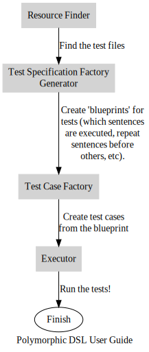

:toc:
= Configuring PDSL

PDSL is designed so that you can represent your tests just about any
way you would want to. To allow you to do that there are parts of the
framework where you can integrate your own custom logic:




== JUnit5 PDSL Config Parameters

The PDSL Configuration has information relevant to _all_ of the test
cases it is responsible for. It is created and modified by using a builder
object:


[source,java]
----

 PdslConfigParameter.createGeneralPdslConfig(
                            () -> TEST_CASE_FACTORY,
                            () -> TEST_SPECIFICATION_FACTORY_GENERATOR,
                            List.of(
                                  // PDSL Test Parameters objects
                    )
                    .withResourceRoot(Paths.get("../../documentation/images/graphviz").toUri())
                    .withRecognizerRule("dotFile")
                    .build()
----

==== Application Name

The application you are testing. This is useful only if you are generating reports. It is used by report generators to group different types of tests
you do to their respective applications.

`.withApplicationName("My e-commerce website")`

==== Context

The context is useful only if you are generating reports. It specifies
the _kind_ of tests you are doing for the application (e.g., unit, component, API, Integration, System, Smoke or something else). This
helps report generating tools show you _where_ in the application the
errors are failing when you try to test a particular requirement.

`.withContext("Unit")`

==== Resource Root

A common location to search for all resources. All included/excluded files
will be searched for from this location.

E.g., in the below example the files _website1.dot_ and _website2.dot_ will be
searched for under _./src/test/resources/features_.

[source,java]
----
PdslConfigParamater.Builder builder = // Create the builder

builder.withResourceRoot(Paths.get("src/test/resources/features").toUri());
builder.withPdslTestParameters(List.of(
        new PdslTestParameter.Builder(() -> SINGLETON,
                    DotNavigationLexer.class,
                    DotNavigationParser.class)
        .withIncludedResources(new String[] {
                            "website1.dot",
                            "website2.dot"
                    })
));

----

==== Recognizer

PDSL has the goal of sharing a DSL test with different applications or teams. However, some applications may have specific test logic required
for them in the grammar that is not relevant for the others.

PDSL is designed so you can follow the _Interface Segregation Principle_. You won't be forcing others to implement test logic or methods that don't
matter for them. No one will force _you_ to provide empty or meaningless
implementations that don't matter to your application.

However, we _can't_ just ignore sentences we don't recognize. These are
common scenarios that could cause harm in your DSL:

* A subtle typo is made in a sentence. Ignoring it causes your test to silently pass even though core logic wasn't executed.
* A sentence was deleted by your team, but there isn't enough coordination to recognize that no other teams are using it either.
* A new sentence was added by another team and you _definitely_ care about the new logic and should implement it yourself.
* The sentences in the DSL are valid, but they are in a nonsensical order

The job of the recognizer is to make sure every sentence in the DSL you are
processing is valid, even if you personally don't intend to do any work with it.
This prevents a lot of maintenance headaches you would otherwise have to deal with.

The recognizer does not kick off any test logic whatsoever. It reads all the relevant sentences in the DSL and stops the test run if it can't recognize a sentence. This gives you rapid feedback if there is something
weird going on with your input.

NOTE: if you do not provide a recognizer at all then the parser is treated as the recognizer instead.

If a recognizer is provided to the PDSL configuration then that recognizer will be used for all <<JUnit5 PDSL Test Parameters, PDSL tests>> by default unless they <<Recognizers, specify one themselves>>.


===== Recognizer Rule

The recognizer you use needs to have a rule that specifies how the input should look. Assume you had the following DSL:

[source,gherkin]
----
Scenario: Shut door
    Given a door
    And the door is shut
    When I open the Door
    Then I can walk through the door

Scenario: Open door
  Given a door
  And the door is open
  Then I can walk through the door
----

Suppose somebody wrote this test by mistake:

[source,gherkin]
----
Scenario:
  Given a door
  And the door is shut
  Then I can walk through the door #How!? It's shut!
----

Other conventional tools will only notice this mistake at runtime. This can be obnoxious when it is part of a large test suite that had to run
for half an hour before the simple issue was detected.

PDSL can catch these sorts of problems in the recognizer:

[source,antlrv4]
----
parser grammar MyRecognizerParser;

options {tokenVocab=MyRecognizerLexer;}

givenDoor: GIVEN_A_DOOR;
givenDoorShut: GIVEN_THE_DOOR_IS_SHUT;
givenDoorOpen: GIVEN_THE_DOOR_IS_OPEN;
whenDoorOpen: WHEN_I_OPEN_THE_DOOR;
thenCanWalkThrough: THEN_I_CAN_WALK_THROUGH_THE_DOOR;

//  Note the default syntax check rule requires tests to be written
//  in 2 specific ways
polymorphicDslSyntaxCheck: (
  (givenDoor givenDoorShut whenDoorOpen thenCanWalkThrough)
  | (givenDoor givenDoorOpen thenCanWalkThrough)
)+;

----

Unless you explicitly specify otherwise, PDSL will look for a rule named
*polymorphicDslSyntaxCheck* that will make sure your sentences are in an
expected order. The syntax check above will prevent someone from writing
a test where someone attempts to walk through a closed door. Anything that
doesn't match the syntax check rule will prevent the test suite from executing until it is fixed.

==== Test Run Executor

The executor is what actually processes the tests, logs to the terminal and generates results. This parameter has a sane default, so you do not have to
provide one unless you're doing something extraordinary.

If you are looking to make your own executor then simply implement either
_PolymorphicDslTestExecutor_ or the _TraceableTestRunExecutor_ interfaces.

==== TestResourceFinder

Tests resources are the files, website resources or other inputs that point
to the test files you use for DSL test cases. They need to be located, opened
and processed somehow.

The resource finder's job is to take included and excluded resources and
figure out how to get to them. In the standard test resource finder PDSL
looks on the file system and uses glob expressions to determine which
files to use.

In other words, you can do something like _src/test/resources/\**/*.feature_ to get all feature files under the
resources directory while excluding _src/test/resources/workInProgress/*.feature_.

However, if you decide you want to get your resources in some other way
(such as crawling the internet some unique way) you are free to provide a ResourceFinder
of your own making.

==== TestSpecificationFactoryGenerator

Consider this Gherkin file:

[source,gherkin]
----
Feature:

   Background:
     Given a top level background step

      Scenario:
         Given a foo

   Rule:

      Background:
        Given a rule background

      Scenario:
        Given a <word>

      Examples:
      | word |
      | bar  |
      | bizz |

   Rule:

     Background:
       Given another rule background

     Scenario:
       Given a gralt

----

This feature file actually produces multiple test cases (called pickles)

[source,gherkin]
----
#1
Given a top level background step
Given a foo
#2
Given a top level background step
Given a rule background
Given a bar
#3
Given a top level background step
Given a rule background
Given a bizz
#4
Given a top level background step
Given another rule background
Given a gralt
----

A feature file can have multiple backgrounds that need to be put before
each scenario. It can also have tables, which are a sort of template for
creating multiple tests from the outline.

PDSL can take an arbitrary DSL and create tests from it, but it needs to
know if you need some sort of control flow, looping or other logic in
your test.

To handle this, PDSL has the concept of a _Test Specification_, which is
really just a blueprint that represents how your test logic is structured.

PDSL handles gherkin by default, so you only need to specify a TestSpecifcationFactory generator if you are using some other DSL.

A Test Specification Factory Generator takes a _phrase filter_ (which is
just a recognizer and parser providing context for interpreting the parts of your DSL that you
care about) and makes a Test Specification Factory. The Test Specification Factory then creates Test Specifications.

The Test Specifications are fairly simple. The have the URL they originally came from, a name and optionally phrases that should be
executed. Importantly, Test Specifications can have other nested specifications that allow to represent things like "before all" phrases.

To learn more about which factories are provided by PDSL by default, please see <<specification_factories.adoc#, Test Specification Factories>>.


==== Test Case Factories

The Test Case Factory interprets a Test Specification and determines how
many test cases to produce from it and how to organize the sentences to
execute in each one (see <<TestSpecificationFactoryGenerator, Test Specification Factory Generators>> for a concrete example).

For information about the Test Case Factories PDSL provides by default, see
<<test_case_factories.adoc#, PDSL Test Case Factories>>


== JUnit5 PDSL Test Parameters

While the PDSL Configuration has parameters that are generally applicable
to all tests, the tests themselves need specific information.

The most important are the parser and lexer classes. These determine
which sentences have code executed by PDSL. Either a visitor or listener
must also be provided for performing this code execution.

=== Included/Excluded Resources

These are the locations to source files that have tests written in your DSL.

By default glob expressions are supported for locating files on the filesystem.

For example in the PDSL test below we see that any feature files in the
_myapp_ directory are included, as are any feature files in and beneath the _regression_ directory EXCEPT for the ones under _workInProgress_:

```
new PdslTestParameter.Builder(() -> SINGLETON,
                    DotNavigationLexer.class,
                    DotNavigationParser.class)
        .withIncludedResources(new String[] {
            "src/test/resources/features/myapp/*.feature",
            "src/test/resources/features/regression/**/*.feature"
        })
        .withExcludedResources(
            (new String[] {
            "src/test/resources/features/regression/workInProgress/**/*.feature"
        });

```

=== Start Rule

The start rule is what PDSL uses when trying to execute a sentence in your DSL. By default, PDSL assumes you have a rule named _polymorphicDslAllRules_ in your grammar unless you override this parameter.

Consider the following grammar:

[source,antlrv4]
----
parser grammar MyAppsParser;

// ... options specified

siteLaunched: 'The user browses to the website';
logIn: 'The user logs in';
addToCart: 'The user adds a product to a cart';
checksOut: 'The user checks out';

polymorphicDslAllRules: siteLaunched
  | logIn
  | addToCart
  | checksOut;
----

When PDSL gets a test case created by a test case factory that factory often breaks the dsl into multiple sentences (although some factories
may give you everything in one big chunk). The purpose of the start rule
is to be able to get a sentence and decide if it's one you should execute
code on.

In the above example we would execute code if we saw that the user wanted to launch the website,
log in, add a product to the cart or check out. This would make sense if
we were testing from a web browser.

But if we were testing API calls it wouldn't make sense to launch the
website (after all, we wouldn't be testing the UI). The start rule
allows you to cheaply control this:

[source,antlrv4]
----
parser grammar MyAppsParser;

// ... code excluded for brevity

// We delete the siteLaunched rule. Now it will be ignored.
polymorphicDslAllRules:
   logIn
  | addToCart
  | checksOut;
----

If this parser is used for API tests now, any sentence for launching the
website will be safely ignored so we only have to focus on the APIs.

==== Sharing rules across applications

Once your grammar is used by enough applications you will probably want
to use multiple files to explain business logic. It's a best practice to
keep your start rule out of files you might be sharing:

[source,antlrv4]
----
parser grammar CustomerParser;

// ... code excluded for brevity

customerSignsUpForNewsletter: GIVEN_CUSTOMER_SIGNS_UP_FOR_NEWSLETTER;
customerUpdatesPaymentInfo: WHEN_CUSTOMER_UPDATES_PAYMENT_INFO;

----

[source,antlrv4]
----
parser grammar ServiceParser;

// ... code excluded for brevity

serviceSendsEmail: GIVEN_SERVICE_SENDS_EMAIL;
serverProcessesPayment: WHEN_SERVER_PROCESSES_PAYMENT;

----

Instead, you can
import the rules you care about and expose them in a parser for that
purpose:

[source,antlrv4]
----
parser grammar ServerApiTestParser;
// Only run sentences that are server facing
import ServiceParser;

polymorphicDslAllRules: (serviceSendsEmail | serverProcessesPayment)+;

----

[source,antlrv4]
----
parser grammar IntegrationTestParser;
// Run sentences that are backend and frontend facing
import ServiceParser, CustomerParser;

polymorphicDslAllRules: (serviceSendsEmail
 | serverProcessesPayment
 | customerSignsUpForNewsletter
 | customerUpdatesPaymentInfo )+;

----

WARNING:: Take care that you don't import multiple parsers that have the same start rule name! If two parsers have the rule _polymorphicDslAllRules_ it can
cause difficult to debug problems!

=== Recognizers

The PDSL Test can specify a recognizer. If so it will be used instead of
a potential recognizer specified by the PDSL Configuration. See <<Recognizer, the PDSL Config Recognizer>> for more details about
what recognizers are for.

=== Test Recognizer Rule

A Recognizer Rule specified in a test will override one provided by the
PDSL config.
See <<Recognizer Rule>> for more information.

=== Tag Expression

A string may be provided to do potential filtering of tests. In the case you
are writing Gherkin tests, you could use a tag like this:

"not @WorkInProgress and (@API or @Integration)"

This would only run scenarios that met the logical criteria:

[source,gherkin]
----

Feature:

  # This scenario will NOT run
  @WorkInProgress
  Scenario:
   Given a step

  Scenario:
    Given a <word>

   # These examples will NOT run
   @System @Smoke
   Examples:
    |  word  |
    | System |
    | Smoke  |

   # These examples WILL run
   @Integration @System
   Examples:
   | word        |
   | integration |
   | Bar         |

  # This scenario WILL run
  @API
  Scenario:
    Given an API
----

If you are not using Gherkin, the behavior of the tag parameter will be
whatever the implementor of your factories decided they should do (which may very well be nothing).

=== Filtering out Duplicate Tests

Part of the interpreter pattern is sharing the same test with other teams, platforms,
clients, etc.

This is powerful! This allows one team to do a single unit of work and create
many tests for many teams!

But for this to be done _efficiently_ the Interface Segregation Principle needs
to be followed. In short, your coworkers should not create work for you unless
it is important for you to do that work.

One of the central parts of PDSL is its ability to figure out how to ignore
work that isn't relevant to you. For example, consider the below gherkin
file which might be shared by two teams.

[source,gherkin]
----

Feature:

  Scenario:
   Given a thing everybody cares about

  Scenario:
    Given a thing everybody cares about
    But there's an additional thing some other team cares about

----

Here there are two distinct test test cases. But suppose the 2nd has a step
that only matters to one team. What does PDSL do? It filters out the step you
don't care about and transforms it into this:

[source,gherkin]
----

Feature:

  Scenario:
   Given a thing everybody cares about

  Scenario:
    Given a thing everybody cares about
    # Get rid of the step that doesn't apply to your parser
----

The result is that _after filtering_ that you get two duplicate tests. 
(PDSL will not keep sentences that it can't find in your parser). 
It is likely that you'll just run the same test twice with no meaningful
difference between the two.

By default, PDSL will run these duplicates, but it is possible to trigger
a feature that will make it ignore duplicates. If you pass the system property
_pdsl.filterDuplicates=true_ then it will not run tests that have an identical
step body.

E.g. `mvn test -Dpdsl.filterDuplicates=true`

