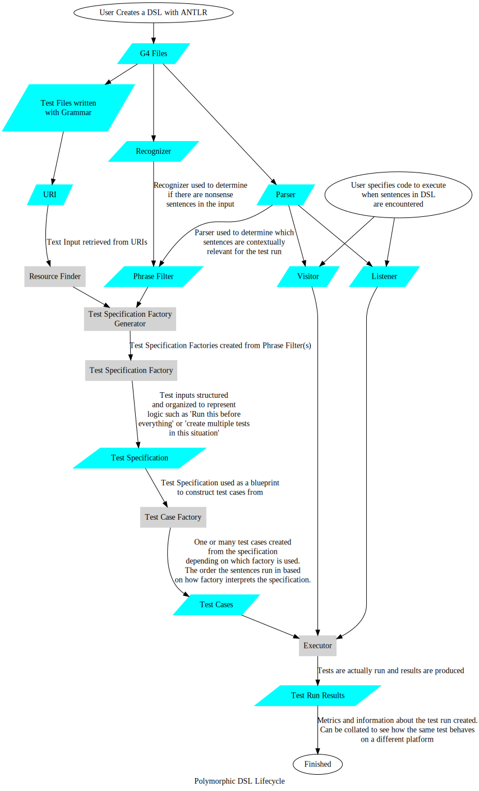

:toc:
= Polymorphic DSL Architecture

This section explains what PDSL is doing behind the scenes. This document
is intended for library developers or those who are trying to extend
the framework in new ways for their own use cases.

== The PDSL Lifecycle

The PDSL framework is designed to be extended or embedded in other test frameworks. It has distinct factories that can be specified by users
to allow everyone to write tests in a grammar that makes sense for them.

The process is shown visually below:

The grey boxes indicate areas where users can swap out the standard
PDSL logic with their own or otherwise customize the framework. Those
creating libraries for PDSL are encouraged to make it possible for
users to continue to do these things with their library.

== G4 Files

PDSL follows the interpreter pattern. However, a downside of the interpreter
pattern is that when you change the language you use to describe a problem
you may have to rewrite a large part of the parser. PDSL solves this problem
by using ANTLR, which is a parser generator.

While the user still may need
to make changes in ANTLR, ANTLR will do the difficult job of generating a
new parser. It will also do it in a way that doesn't require the user of the
library to need heavy knowledge of parser theory (We've seen junior engineers
with no knowledge of this successfully use the framework without much trouble).

The G4 files are the foundational inputs for PDSL: they are used by the
end user to create their DSL test files, the parser and recognizer.

=== DSL Test Files

These are the inputs that represent the users tests, whether it's gherkin,
DOT, sequence diagrams or whatever the user has decided. PDSL needs a URI
to these sources to process them. PDSL ultimately processes these URIs as
streams of UTF-8 characters (the alphabet for ANTLR), so they do not
necessarily need to be files.

== Scaling with a Phrase Filter

One of the principal goals of PDSL is to have a single test be used to
test multiple platforms, clients or applications. However, these different
consumers of the test case will likely have different needs. A core coding
practice required for PDSL to work is to follow the _Interface Segregation Principle_.
In other words, we can't force other clients to implement behavior for things
that aren't relevant to them. This is accomplished with the _Recognizer_ and
_Parser_.

Combined they form a _Phrase Filter_. The phrase filter determines:

. That all of the sentences in the grammar are valid
. Which sentences are relevant to the test being created and
should therefore have test logic executed

These jobs are handled by the recognizer and parser respectively.

=== Recognizer

It is established that an arbitrary system under test doesn't need
to run every sentence. Naively PDSL could have just had the framework execute sentences
that the parser could understand and ignore everything else. But this has
the problem of allowing people to make typos or mistakes in the grammar that are
silently ignored.

This is especially problematic when you're sharing your DSL test with
other teams. How are they supposed to know your sentence is nonsense?

The recognizer solves this problem. Before every test the recognizer will
read _every_ sentence in the input test. If it doesn't recognizer something
it will crash before any test code is executed. The recognizer doesn't
actually _do_ anything other than make sure the sentences are known to
exist.

NOTE:: When talking about parsing, technically a parser and recognizer are the same thing. However, because PDSL actually uses 2 parsers, we call
the one whose job is to just literally recognize things the recognizer
and refer to the one that _does_ test logic the parser.

=== Parser

The parsers job is to specify which sentences should have some code
executed when they are encountered. Any sentence not recognized by
the parser is simply ignored
(this can be safely done because of the aforementioned recognizer).

ANTLR parsers provide either a listener or visitor interface associated
with them. The end user provides their own, custom test logic using
one of these two interfaces. When the parser encounters a sentence it
recognizes an associated method in the listener or visitor is then
invoked at the appropriate time.

== Resource Finder

The PDSL tests are provided to the framework by URIs. The input itself
could vary substantially: it could be a file on the local filesystem, or
it could be a URL on the internet. The resource finders job is to acquire
the information from the URIs.

By default PDSL assumes that the user wants to look on their local filesystem
for this data, but the user is free to provide their own resource finder
if needed.

== Test Specification Factory Generators

PDSL supports tests written in all sorts of ways. Some of these tests
might have some form of control flow, such as loops. These are analogous
to hooks in test frameworks, such as _before all_, _before each_, after all_, etc.

Test Specification Factories create _Test Specifications_, which are blueprints
that represent the DSL test in a way that captures these nuances. A
DSL test might have comments or metadata in it that is not useful to
act on, so the test specification factory also determines which parts
of the DSL test are important to execute code on and which parts are
just informative.

The Test Specification Factory cannot determine which sentences are
important without a <<Scaling with a Phrase Filter, Phrase Filter>>.
Because of this the PDSL framework has Test Specificaiton Factory _Generators_
that can create Test Specification Factories from the supplied
Phrase Filter.

The Test Specification Factory will take a URI and use a _Phrase Filter_
to generate one or more _Test Specifications_ that can be interpreted by
a _Test Case Factory_.

== Test Case Factories

The Test Specification is just a blueprint. That blueprint might represent
one or many test cases. It might require certain sentences to be executed
before every test case or something else.

The _Test Case Factory_ interprets the Test Specification and produces
one or more test cases from it.

== Executors

After we know what the test cases actually are we can actually _execute_
the tests. The _Test Executors_ are what actually do the work. They trigger
the code execution, logging and other things you typically see when you run
PDSL.

Another important job Executors have are to produce the _Test Run Results_.

== Test Run Results

One of the goals of PDSL is to provide a commensurate comparison of different
applications handling a similar business requirement. This is difficult
to do unless you can map the results of multiple tests to the same
requirement.

These results can be combined and processed by a _Report Generator_ of some
kind to show these relationships (i.e., the feature passes in application
A but fails in B on the API layer).

PDSL does not force any results to be generated unless the user explicitly
asks for them. An implementation of the _TraceableReportGenerator_ can be
given to produce a report in whatever format the user sees fit.

PDSL has additional interfaces for making these reports structured with
different layers of granularity. They are not mandatory for use, but may
create reports that are suitable for different stakeholders:

**Optional Reporting**

. Strategic Reports: The high level results of all applications and systems under test.
. Operational Reports: The result of a combination of test suites (such as unit,
component, API, etc) for a system under test.
. Tactical Reports: A summary of tests results for a specific application without explaining why they failed. This could include code coverage.
. Technical Reports: Stack traces, sentences and other low level details
for a specific test