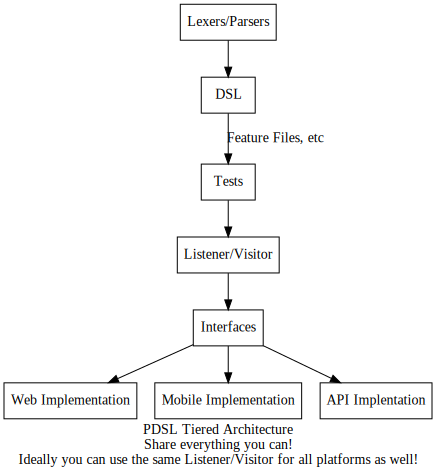

= PDSL Readability
:sectnums:

The interpreter pattern won't work if you use the library or design your test framework incorrectly. The hardest part teams have with PDSL is not the technical implementation or the regular expressions, but following the _interface segregation principle_. There are some other common tropes as well. This document provides guidance to people who review PDSL code to make sure it's being used correctly.

== Don't couple the DSL to an implementation

=== Don't use platform specific terminology

[source,gherkin]
----
Scenario: A bad scenario

Given the user logs in to My Application
And the user navigates to the home page
And the user clicks the Account icon
When the user selects the project type dropdown
And the user types "My Project" into the field
And the user types "Some text" into the memo field
And the user submits the form
Then the project is created
And the project is visible in the account details page
----

Words like "navigates", "clicks", "page", "icon", "types" or "field" apply to a specific implementation. This makes your DSL unsuitable for scaling laterally. I.e the above test could not be used for mobile, REST APIs or other related platforms.

The above scenario can be decoupled by using words that are not tightly bound to the implementation:

[source,gherkin]
----
Scenario: A bad scenario

Given the user access My Appplication
And the user views account details # Note navigation can be combined into this step along with the click

When the user selects the project type dropdown
And the user types "My Project" into the field
When the user creates a project with the following details:
"""
Name: My Project
Meme: Some Memo
"""
Then the project is created
And the user can find the project and view the details
----

The above scenario works well not just for web, but mobile or the backend too. You could even use the same scenario for unit tests if desired.

=== Handling platform specific requirements

The interpreter pattern is to be used for generic, repetetive tests. But sometimes you may have a requirement for a specific implementation. What should you do then?

== Avoid mixing platform specific DSLs with common DSLs

You may not need the interpreter pattern under these circumstances. In that case you can take a non-DSL approach. But if you create a grammar for these *don't mix your platform specific grammars, feature files or artifacts with the shared ones!*

Put them in their own location under all circumstances.

E.g.

```
features
|
|- common
|  |
|  - UserAccceptance.feature
|  - Regression.feature
|
|- web
|   |
|   - MyWebApp.feature
|
|- mobile
   |
   - MyMobileApp.feature
```

==== Think about whether the generic need exists elsewhere

Suppose you have a requirement to make sure specific buttons, headers or links are on a web page.

At a glance there is no need for a DSL as the requirement is application specific.

However, the need to make sure application layouts are correct is a general need.

In this case make a shared DSL other front ends can use. Make the language generic enough that it gets the point across for everybody and handle the details in the implementation.

Consider the following problematic DSL:

[source,gherkin]
----
Scenario: Bad Scenario

# The first 2 sentences are fine
Given the user accesses My Application
And the user views the account details

# Unnecessary coupling
Then the header has the account number
And the header has breadcrumbs
And the sidebar has quick links
And the account logo is visible
# etc
----

Another applications that has similar needs will need its own feature file. Your maintenance will increase and it will be hard to compare application capabilities. In this case, the simple question "Do our applications look correct for the users?" requires a manual search and comparison. If you have multiple apps, this can be surprisingly expensive to answer.

Instead, make a common DSL:

[source,gherkin]
----
Scenario: Good Scenario
  Given the user accesses My Application
  And the user views the account details
  Then all necessary information and controls are visible
----

You can then handle details in the implementation

[source,java]
----
class WebAccountDetailsValidators implements AccountDetailsValidator {

    @Override
    public void validateAccountDetails() {

        // Check for icon
        // check breadcrumbs
        // Check sidebar
        // etc
    }
}
----

== Use Tiered Architecture

For the interpreter pattern to work best it helps if you maximize code reuse.



== Don't duplicate sentences across lexers/parser

[TIP]
====
Not sure if you have a related sentence?

On Linux and Mac you can go to your antlr directory with a terminal and use `grep -r "some words"` to search all of your parsers and lexers in one go!

On Windows you can use the `findstr` command in powershell.
====

Suppose you have two different requirements you're testing:

[source,gherkin]
----
Scenario: First File

  Given the user accesses My Application
  Then my user does a thing
----

[source,gherkin]
----
Scenario: Second File

  Given the user accesses My Application
  Then my user does a very different thing
----

If you create two separate lexers for each feature file you will have pain if the grammar ever changes. You will have to do _O(n)_ maintenance instead of _O(1)_!

[source,antlrv4]
----
lexer grammar FirstFileLexer;

import GherkinCommonLexer;

// Gherkin Steps
fragment WS : [\r\n\t ] ;
fragment END : WS* ([\r\n]+ | EOF) ;
fragment AND : 'And ';
fragment BUT : 'But ';
fragment WILD : '* ' ;
fragment GIVEN : 'Given ' | AND | BUT ;
fragment WHEN : 'When ' | AND | BUT ;
fragment THEN : 'Then ' | AND | BUT ;

GHERKIN_STEP_KEYWORD : WS* (GIVEN | WHEN | THEN | WILD) ;

fragment NEWLINE : [\r\n];

// End Gherkin Steps

GIVEN_USER_ACCESSES_MY_APPLICATION: GHERKIN_STEP 'the user accesses my application' END;

// Other sentences
----

[source,antlrv4]
----
lexer grammar SecondFileLexer;

// Put the gherkin steps into a common lexer
// Gherkin Steps
fragment WS : [\r\n\t ] ;
fragment END : WS* ([\r\n]+ | EOF) ;
fragment AND : 'And ';
fragment BUT : 'But ';
fragment WILD : '* ' ;
fragment GIVEN : 'Given ' | AND | BUT ;
fragment WHEN : 'When ' | AND | BUT ;
fragment THEN : 'Then ' | AND | BUT ;

GHERKIN_STEP_KEYWORD : WS* (GIVEN | WHEN | THEN | WILD) ;

fragment NEWLINE : [\r\n];

// End Gherkin Steps

// GAH! A DUPLICATE SENTENCE!
GIVEN_USER_ACCESSES_MY_APPLICATION: GHERKIN_STEP 'the user accesses my application' END;

// Other sentences
----

The above examples are particularly ugly because they don't just duplicate a sentence in the grammar, but they duplicate all of the gherkin keyword stuff which takes up a huge amount of space!

The solution here is simple. Just import the lexer(s) that contains the sentences you care about:

[source,antlrv4]
----
lexer grammar SecondFileLexer;

// Note we import a lexer that has the sentences we care about
import FirstFileLexer, GherkinCommonLexer;

// GIVEN_USER_ACCESSES_MY_APPLICATION is already available, so we don't need to reimplement it

// Other sentences
----

Note the above lexer imports the FirstFileLexer which may have sentences that don't matter to the files that the SecondFileLexer will read. This generally doesn't matter unless it creates ambiguity.

In a worst case scenario, break out the common sentences into a new lexer and import it into both:

[source,antlrv4]
----
lexer grammar MyAppCommonLexer;

// Have a separate lexer for GherkinKeywords
import GherkinCommonLexer;
// Common sentences for the "My Product" application

GIVEN_USER_ACCESSES_MY_APPLICATION: GHERKIN_STEP 'the user accesses my application' END;
----

[source,antlrv4]
----
lexer grammar FirstFileLexer;

import MyAppCommonLexer, GherkinCommonLexer;


// Common lexemes for the "My Product" application already included by MyAppCommonLexer

// Other sentences unique to FirstFileLexer
----

[source,antlrv4]
----
lexer grammar SecondFileLexer;

import MyAppCommonLexer, GherkinCommonLexer;


// Common lexemes for the "My Product" application already included by MyAppCommonLexer

// Other sentences unique to SecondFileLexer
----

== Do not couple your Visitors or Listeners to Implementations

In general, any variables your listeners and visitors use should be 100% abstract or close to it. It is a best practice to program entirely using interfaces.

Suppose you have a web and mobile application. If you put your web logic directly in a visitor you will have to double your work!

[source,java]
----
class MyVisitorImpl extends MyParserBaseVisitor<Void> {

    // This is bad!
    // No implementation logic should be in the visitor!
     private final WebDriver webdriver;

    @Override
    public Void visitSomeRule(MyParserContext ctx) {

        // We need another visitor for the mobile and REST tests now. Way to mess it up.
        webDriver.find(By.cssSelector("#account"));
        //Etc
    }
}
----

If you program to an interface this becomes a non-issue. You can use dependency injection to swap implementations as needed without having to create tons of interpreters for each platform:

[source,java]
----

interface CustomerAccount {

    void verifyAccountId(String accountId);
    void viewAccount(String accountId);
}

// Web Implementation
class WebCustomerAccount implements CustomerAccount {

    // Implementation is separated into
    // a specific class that shares the
    // same interface. Great!
    private final WebDriver webDriver;

    @Overridde
    public void viewAccount(String accountId) {

        webDriver.findElement(By.cssSelector("#Account"));
        // Etc
    }
}

// Mobile implementation
class MobileCustomerAccount implements CustomerAccount {

    private final appiumDriver AppiumDriver;

     @Overridde
    public void viewAccount(String accountId) {

        appiumDriver.findElement(By.cssSelector("#mobileAccount"));
        // Etc
    }
}

class MyVisitorImpl extends MyParserBaseVisitor<Void> {

    // The implementation is cleanly decoupled
    // We can use the same
    // visitor for many frameworks!
    private final CustomerAccount customerAccount;


    @Override
    public Void visitSomeRule(MyParserContext ctx) {
        // Use the interface for all behaviors
        customerAccount.viewAccount(ctx.ACCOUNT_ID.getText());
    }

}
----

