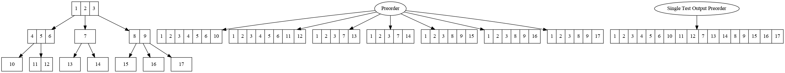

:toc:
= Test Case Factories

Some specifications (such as gherkin) can be relatively elaborate and have a single
input that represents many outputs. Test case factories determine how many test
cases to turn a <<specification_factories.adoc#, specification>> into, as well
as making sure that the relevant phrases are executed in the proper order for each
one.

The data structure for the specification is recursive; specifications can contain child
specifications. This ultimately creates a tree of nodes to traverse.

While many DSLs users create will be quite simple and can thus be handled properly
by multiple factories due to their simplicity, more complex grammars (notably gherkin)
require you to be careful about which one you pick.

An obvious use case for this would be a DSL where you have a group of phrases that
run before subsequent groups of phrases. The specification will represent this via a parent/child
releationship of some sort and at that point PDSL needs to know how to traverse the
specification to create the correct test(s).

== Preorder Factories

The built-in preorder factories will always run their parent phrases before each child phrase.

The link:../src/main/java/com/pdsl/testcases/PreorderTestCaseFactory.java[PreorderTestCaseFactory] will produce a test case for each leaf node.

The link:../src/main/java/com/pdsl/testcases/SingleTestOutputPreorderTestCaseFactory.java[SingleTestOutputPreorderTestCaseFactory] will produce only one test case from the entire tree.

The image above describes the expected output after traversing the tree on the far
left of the image.

=== Test Case Factory DSL

As a side note, this image is derived from a DOT file that is used
as a test case to make sure these factories (and any future factories implemented)
work properly. PDSL uses itself to test itself after all the lower level tests run.
This serves as yet another example of how to use the interpreter pattern to make
application behavior more understandable than source code can allow.

The DOT file was much easier to create test cases in because we could see what we
were doing. Verbally describing the problem in the feature file seemed to be useful,
but we expect it will be much more difficult for people to understand the expected
inputs/outputs when they have to mentally translate everything from English to the
tree it describes. This is despite the fact that the feature file is testing a _far_
simpler model than the DOT file.

[source,cucumber]
----
include::../src/test/resources/framework_specifications/features/TestCaseFactory.feature[Test Case Factory Feature]
----
